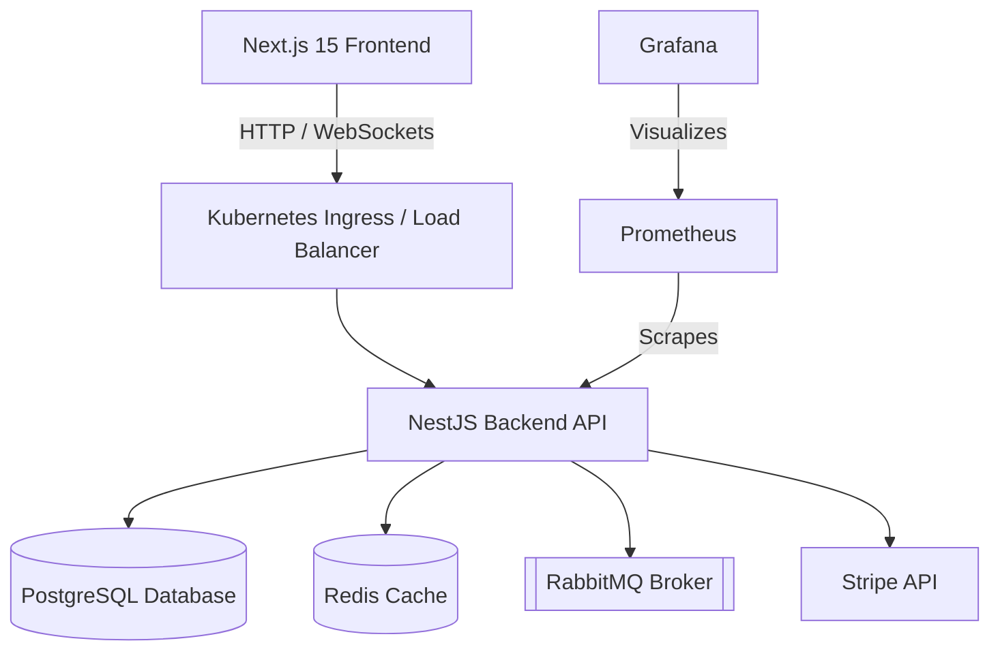

<div align="center">
  

  <br />
  <br />

  <h1>🚀 We Got Jobz Marketplace</h1>
  <p>
    <b>A production-ready, fully scalable freelance marketplace built for the enterprise.</b>
  </p>
  <p>
    Powered by Next.js 15, NestJS, Turbo Monorepo, better-auth, Kubernetes, and comprehensive telemetry.
  </p>

  <div>
    
    
    
    
    
  </div>
</div>

---

## 🌟 Welcome to the Future of Freelancing

Stop scrolling through endless job boards. **We Got Jobz** is a premier platform connecting exceptional freelancers with visionary companies. Every feature is designed to remove friction, so you can focus on what matters — great work.

## ✨ Incredible Features

### 🏢 Core Marketplace
- **Job Management**: Effortlessly create, browse, and manage freelance jobs.
- **Bidding System**: Freelancers submit highly competitive bids with detailed proposals.
- **Contracts**: Secure, escrow-backed contracts with milestone-based payments.
- **Real-time Messaging**: Lightning-fast WebSocket-based communication between clients and freelancers.
- **Reviews & Ratings**: Authentic, verified reviews built into a comprehensive rating system.

### 🛡️ Uncompromised Security & Auth
- **Better Auth Integration**: Secure email/password & OAuth (Google, GitHub).
- **Session Management**: Automatic session validation with lightning-fast Redis caching.
- **Role-based Access Control**: Distinct experiences for Employers, Freelancers, and Admins.
- **Rate Limiting**: Intelligent endpoint rate limiting via NestJS throttler.

### 💰 Payments & Monetization
- **Stripe Integration**: Fully wired payment processing ready for production.
- **Milestone Payments**: Funds are held securely in Escrow until milestones are approved.
- **Subscription Plans & Commission**: Tiered pricing with a seamless 10% platform fee on completed jobs.

### 🏭 Enterprise Scale & DevOps
- **Docker Containerization**: Multi-stage builds for lean, incredibly fast images.
- **Kubernetes Orchestration**: Production-ready K8s manifests, including Horizontal Pod Auto-scaling.
- **Message Broker**: Fully integrated **RabbitMQ** for reliable background task processing.
- **Centralized Logging & Monitoring**: Complete observability stack using **Prometheus**, **Grafana**, and **Loki**.
- **CI/CD Pipeline**: Automated GitHub Actions ensuring flawless deployments.

---

## 🛠 Top-Tier Tech Stack

### Frontend Excellence
- **Next.js 15** (App Router, React 19)
- **TypeScript** & **Tailwind CSS**
- **shadcn/ui** for stunning components
- **TanStack Query** for robust caching

### Backend Power
- **NestJS** & **Prisma ORM**
- **PostgreSQL 16** & **Redis 7**
- **RabbitMQ** for event-driven architecture
- **OpenTelemetry** for deep tracing

### DevOps Mastery
- **Docker** & **Kubernetes**
- **Helm** Charts
- **Grafana**, **Prometheus**, & **Loki** Stack

---

## 🚀 Quick Start Guide

### Prerequisites
Make sure you have Node.js 20+, pnpm 8+, Docker, and Docker Compose installed.

### 1️⃣ Installation

```bash
# Clone repository
git clone https://github.com/yourusername/we-got-jobz.git
cd we-got-jobz

# Install dependencies super fast
pnpm install

# Setup environment variables
cp .env.example .env.local

# Push database schema & start services
pnpm db:push
```

### 2️⃣ Run with Docker Compose (Recommended)

Start the entire stack — including the database, Redis cache, RabbitMQ broker, and all observability tools!

```bash
docker-compose -f docker-compose.yml up -d
```

### 3️⃣ Start Hacking!

```bash
pnpm dev
```

🎯 **Your Services Are Live At:**
- **Frontend App**: [http://localhost:3001](http://localhost:3001)
- **Backend API**: [http://localhost:3000](http://localhost:3000)
- **API Documentation**: [http://localhost:3000/api/docs](http://localhost:3000/api/docs)
- **Grafana Monitoring**: [http://localhost:3002](http://localhost:3002)

---

## 🏗 High-Level Architecture

We Got Jobz utilizes a modern distributed architecture capable of handling massive loads while providing an incredible developer experience.



---

## 📊 Complete Observability Built-In

Monitoring is a first-class citizen in We Got Jobz. Dive into the data instantly.

- **Prometheus Metrics** (Port 9090): Scraping request counts, latency, memory usage, and more.
- **Grafana Dashboards** (Port 3002): Visualizing your application's heart rate in real-time. Login with `admin`/`admin`.
- **Loki Logs**: Aggregated, searchable logs straight in Grafana's Explore tab.

---

## 🤝 Become a Contributor

We welcome all contributions! To get involved:
1. Fork the repository
2. Create your feature branch: `git checkout -b feature/amazing-feature`
3. Commit your changes utilizing Conventional Commits
4. Push to the branch: `git push origin feature/amazing-feature`
5. Open a dazzling Pull Request

## 📝 License

This amazing project is licensed under the MIT License - see the LICENSE file for details.

---
<div align="center">
  <b>Built with ❤️ for the future of remote work.</b>
</div>